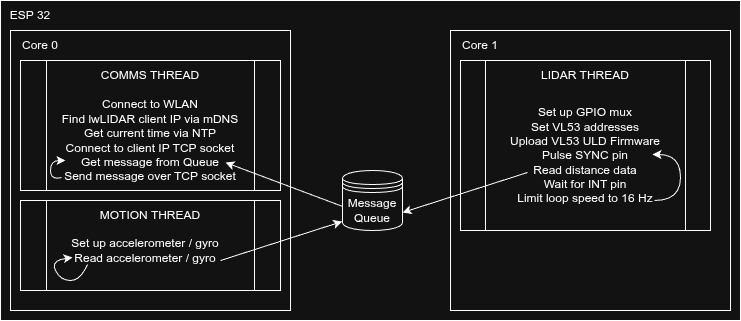
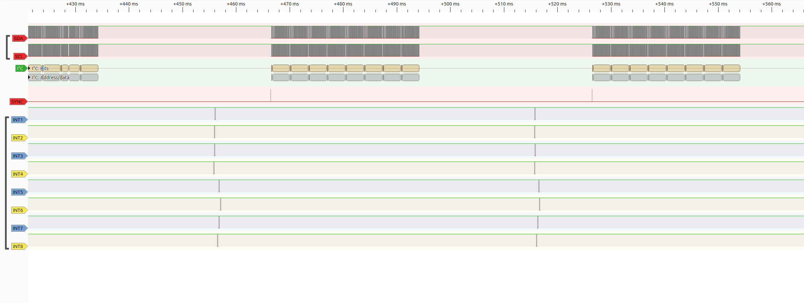

# Firmware
This part is a sample implementation of the firmware. It aims to read the sensors in the array as fast as possible (16Hz@8x8 zones). The main program flow is as follows (see also Firmware/components/thesis/thesis.c)


## Setup
for ST's library, set these options:
```
#define VL53L8CX_DISABLE_SIGNAL_PER_SPAD
#define VL53L8CX_DISABLE_REFLECTANCE_PERCENT
#define VL53L8CX_DISABLE_RANGE_SIGMA_MM
#define VL53L8CX_DISABLE_MOTION_INDICATOR
```


This reduces message overhead, as the esp32's maximum i2c clock speed is 400kHz. This means bus space is very tight. On other systems, i2c clock speeds of 1MHz would allow this extra information to also be read out.


Initialise the GPIO expander:


- set all pins to OUTPUT
- set all pins to follow register 0x05
- set all pins to LOW. This disables all sensors' i2c interface

Initialise each sensor:


- set GPIO expander pin belonging to sensor to HIGH
- set sensor I2C address. NOTE: this is being done "manually" in this implementation rather than using rjrrp's esp-idf component, as that implementation is bugged :)
- upload ST's ULD sensor firmware over I2C. This must be done per-sensor after each power-up.
- set sensor resolution to 8x8
- set ranging frequency to 20
- enable external SYNC pin

## Ranging
- For each sensor, start ranging
- Wait 100ms to allow sensors enough time to start up
- Loop (should be done in a high-priority thread to ensure precise timing):
    - wait such that loop speed is limited to 16 Hz
    - turn on SYNC pin for 1 ms
    - wait for the first sensor's interrupt pin to flip. done with an ISR and semaphore in this implementation
    - for each sensor in order:
        - check data is ready (vl53l8cx_check_data_ready)
        - wait for all i2c transactions to complete
        - get ranging data
    - delay 10 ms


# Configuration
WiFi access point information is configured in components/thesis/include/comms.h


SYNC and INT pins are set in components/thesis/include/thesis.h.

# Firmware layout
This is a quick diagram of the tasks performed by this firmware


# Timing
As previously mentioned, it *is* possible to read all sensors at maximum resolution at 16Hz over an I2C bus running at "only" 400kHz, but precise timing is *very important* (because of available bandwidth):


