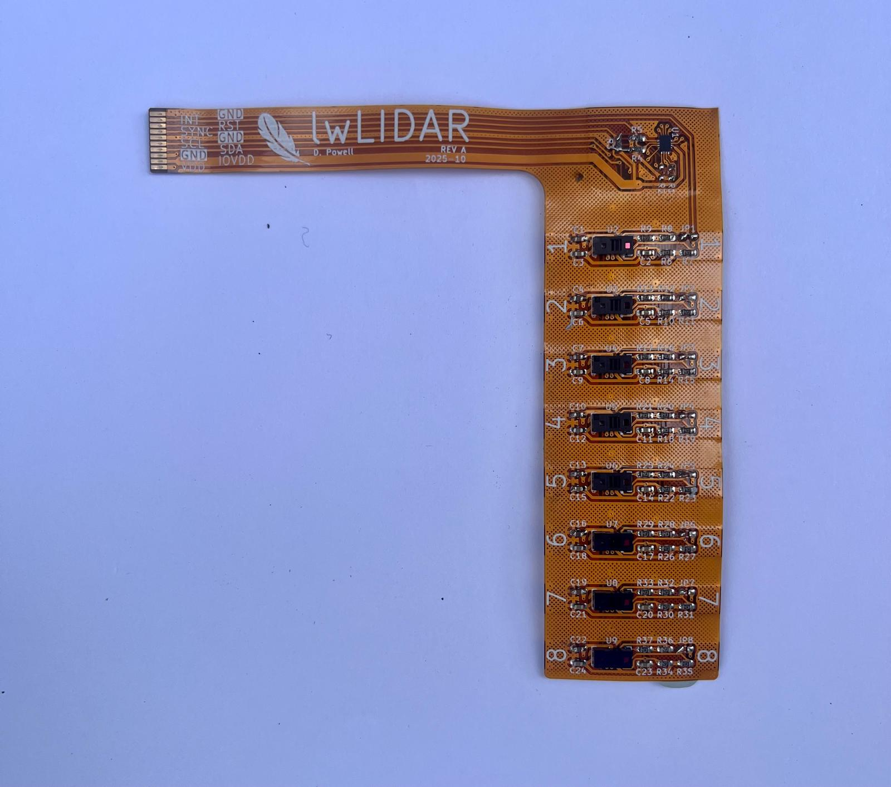
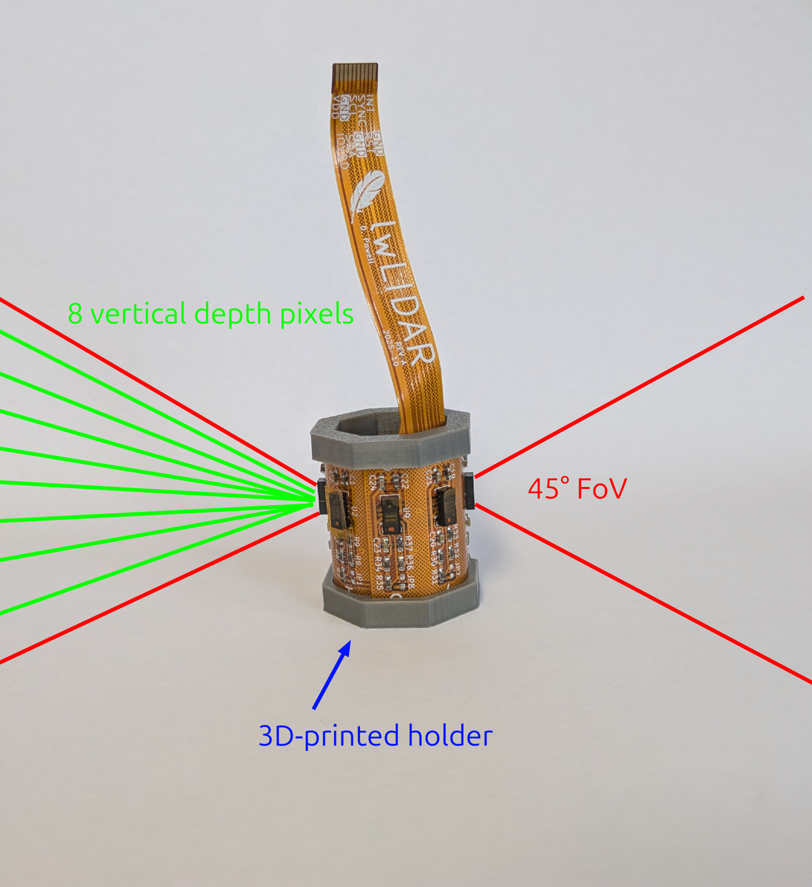

# Flex

This directory contains the KiCAD project files for the flexible PCB. It is only 8 VL53L8CX as well as an I2C GPIO expander. The stiffener layer should be 0.25mm polyimide to ensure the PCB (2 layer, 25um) fits in the molex connector [easy-on 1mm pitch 10 circuits](https://www.molex.com/en-us/products/part-detail/522071060). The PCB fits inside a 100mmx100mm square area to minimise PCB production costs. All passive components are hand-solderable 0603.

# Issues
The state of this directors is as-created for the thesis. This means that the I2C pullups are incorrectly set to pull up to VDD (3.3V), when they should be pulling to IOVDD (1.8V). To save production cost, only PI stiffeners are used. However, to provide better heat wicking from the sensors, it may be advisable to use stainless steel stiffeners behind the sensors. (Avoid stainless steel stiffener on the connector part, it will short out the connector!)
