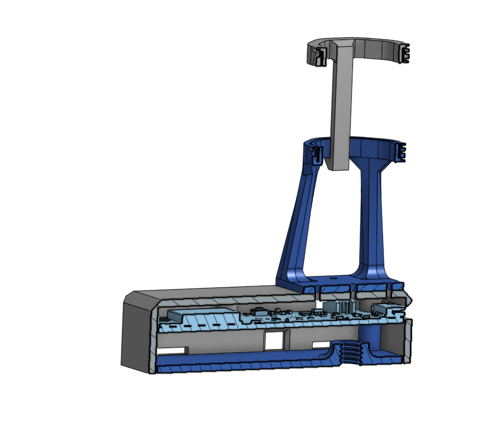
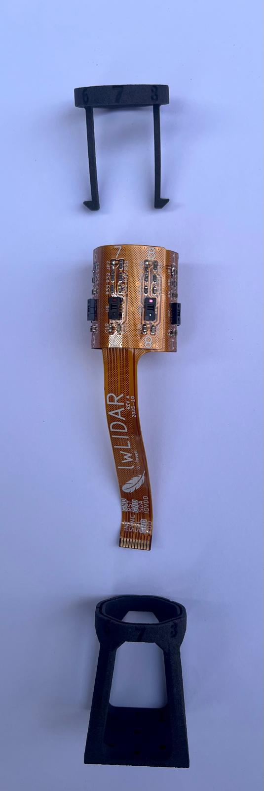

# Mechanical design

The main important part of the mechanical design is the components constraining the flexible PCB. These are named `Flex PCB mast` and `Flex PCB top ring`. In a constrained application, it may be necessary to redesign these to fit better. To this end, there is also a `Flex PCB reference shape` provided, if one wants to start from scratch. It is generated by importing the Flex PCB outline layer from the Flex subdirectory into 3D CAD, and pretending it's a sheet metal part. As well as the Flex PCB constraining parts, there is also `Case Lid` and `Case Body`, which are designed to fit around the interface board, providing a 1/4-20 UNC thread for tripod mounting as well as slots for zip-ties.
