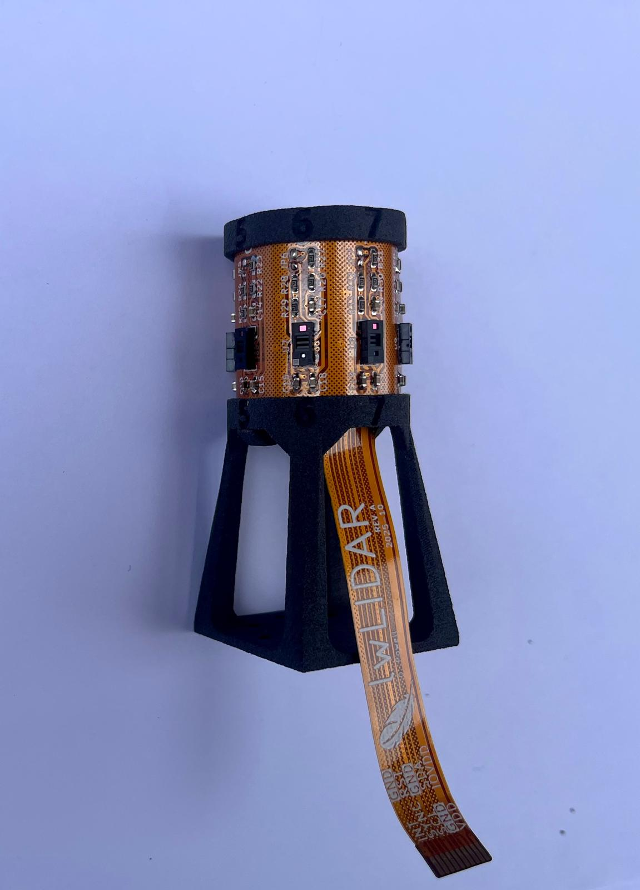
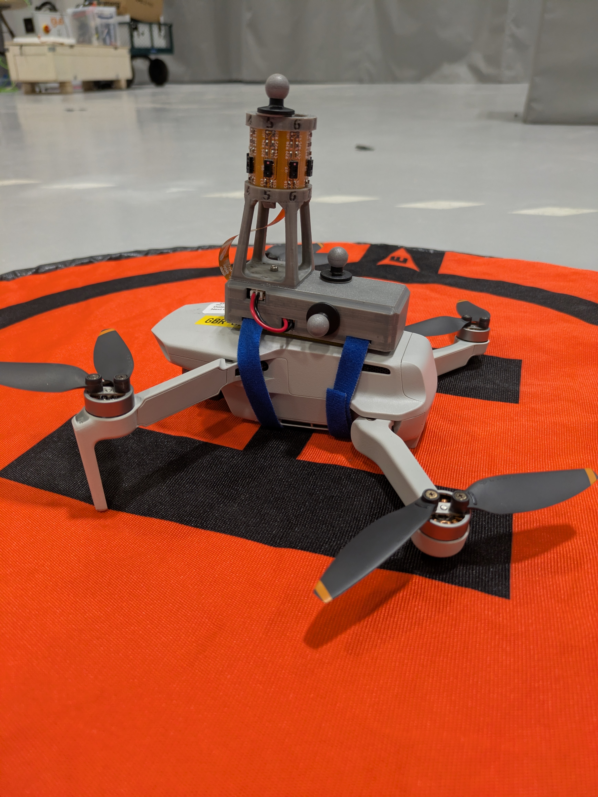

# lwLIDAR

# Summary
lwLIDAR is a research project aiming to design, implement and test a low-cost compact 3D LiDAR for use in constrained robotics research. It consists of an array of 8 VL53L8CX 8x8 matrix LiDAR sensors mounted to a flexible PCB.

# Repository structure
This repository contains all required design files to construct and program a lwLIDAR sensor with an interface board to act as a sample implementation. Each subdirectory contains a more detailed README file.
- Flex - lwLIDAR core sensor PCB
- Rigid - interface board PCB
- Mechanical - 3D CAD files
- Firmware - example firmware to be run on interface board
- Software - example software to visualise live data

# Performance
|-------------------|-------------------------|
| Framerate         | 16 Hz                   |
| Maximum distance  | 4 m                     |
| Resolution        | 8 v x256 h              |
| FoV               | 45° v x 360° h          |
| Size              | 31x31x67 mm (with mast) |
| Weight            | 11g                     |
| Power consumption | 1.5W                    |
|-------------------|-------------------------|

# License
This project is licensed under the GNU AGPL license (see LICENSE.txt).

# Contributing
If you have improvements or want this repo to link to a usecase you made, please submit a pull request! If you have problems, please open an issue - I'm happy to improve this repository over time!
