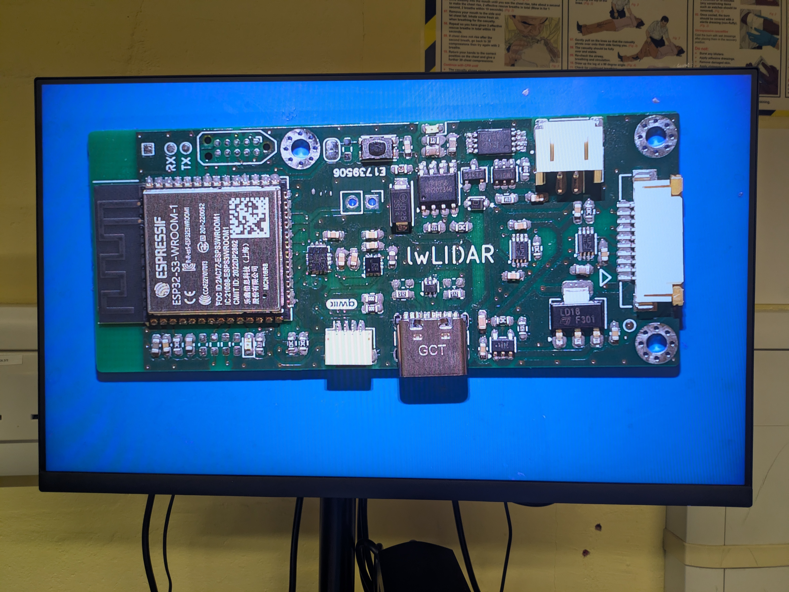

# FR4

This repo contains the rigid part of the lwLIDAR system. It is intended to act as a sample interface design. In a "proper" application, the functionality provided by this board would be implemented as part of the main device (e.g. on a small drone, this would be handled on the drone motherboard.)

# Features
This component provides a power and data interface to the flex PCB, a microcontroller to demonstrate functionality, as well as auxiliary components. The microcontroller is an esp32-s3 module, which allows wireless data streaming and simple USB programming.

Required for sensor operation:
- 3.3V power supply
- 1.8V logic power supply
- I2C bus (400kHz, 1.8V)
- interrupt pin to MCU @ 1.8V
- sync pin to flex PCB @ 1.8V

Additionally:
- Accelerometer / Gyro
- Magnetometer
- TP4056 BMS w/ automatic power switching
- QUIIC port

# Issues
- Power supply is based on low-dropout regulators. During operation, these will get very hot. Ideally, this would be implemented with a switching buck converter.
- No reset button (only boot button), which makes recovery of the esp32 annoying.
- No polarity markings on the battery connector. JST 2-pin battery polarity is NOT STANDARDISED!
- No facility to monitor battery voltage.

