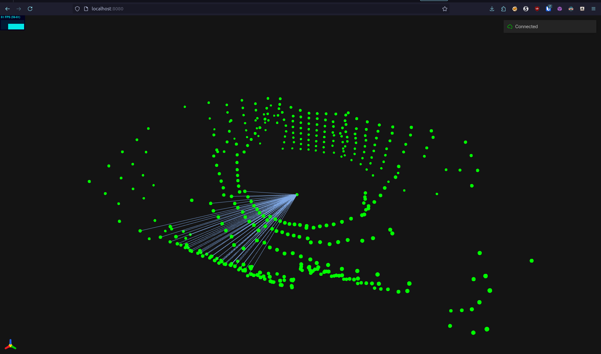

# Software
This software is intended to be run on a separate computer. It opens a TCP port on 3133, figures out its own IP address, and then broadcast it via mDNS. This allows the firmware on the esp32 to find it and connect. Then, received data is passed to Viser, which renders it live in a browser tab.

This program is meant to be a reference implementation only. In a "perfect implementation", this program is not necessary, as the robotic system itself passes the sensor data straight into a message bus system, e.g. ROS or LN.

The idea to use Viser and geom.py are taken from [this lovely repo](https://github.com/ferrolho/VL53L5CX-BNO08X-viewer/) by Henrique Ferrolho, who happened to publish a [video](https://www.youtube.com/watch?v=s32OUzhjf4U) using the same base sensor while I was working on this project.

